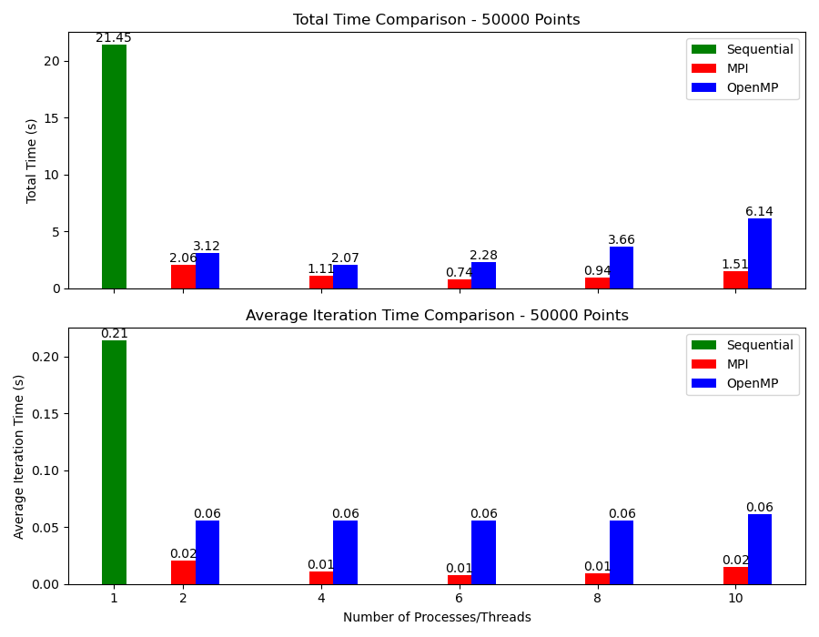
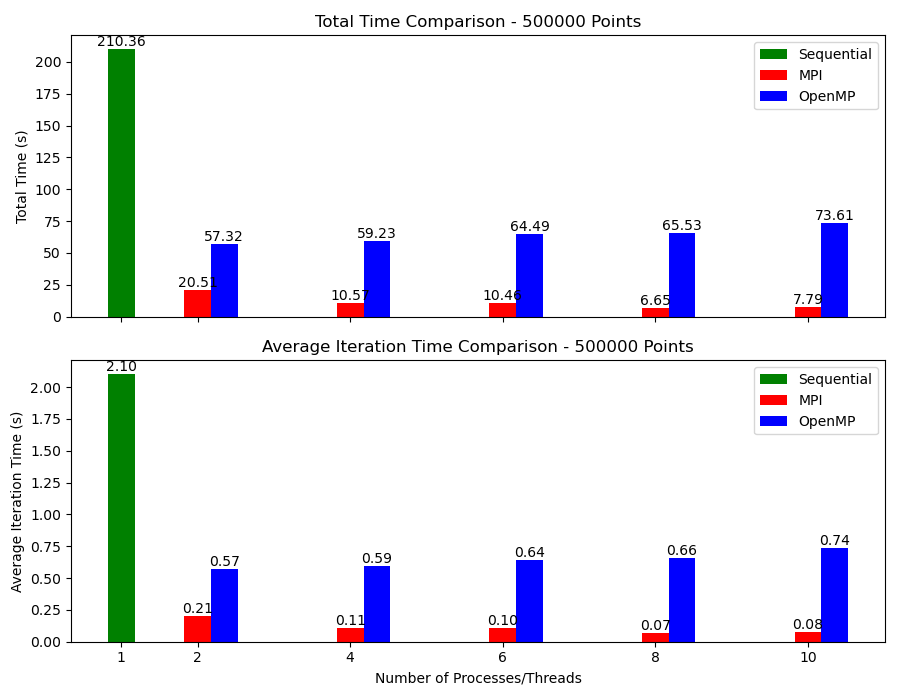
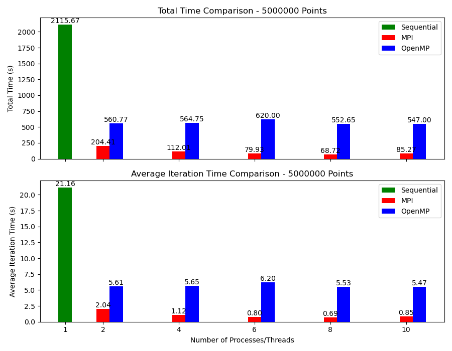
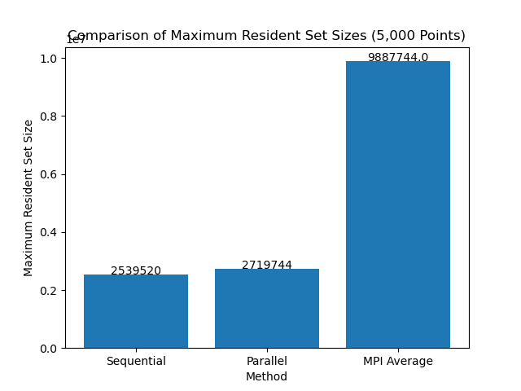

# CMSE 822 Final Project: K-Means Clustering

# 1. Introduction

In the modern era of computational science, efficient processing of large datasets is crucial. This project focuses on the efficiency of parallel computing paradigms in handling intensive computational tasks, specifically K-means clustering. K-means is a fundamental algorithm widely used in data mining and machine learning to group a set of objects based on attributes into K distinct groups (clusters).

K-means clustering involves partitioning n observations into k clusters in which each observation belongs to the cluster with the nearest mean. This mean serves as a prototype of the cluster. Given its computationally intensive nature, especially with large datasets or high dimensionality, parallel computing can play a pivotal role. Parallel computing uses multiple processing elements simultaneously to solve a problem, which can significantly improve the computation speed and efficiency.

This project investigates the application of two parallel computing paradigms: Message Passing Interface (MPI) and Open Multi-Processing (OpenMP). Their effectiveness is evaluated based on performance metrics such as computation time and efficiency in implementing the K-means clustering algorithm [1, 2, 3].

## 1.1 Background


The K-means algorithm operates through an iterative refinement technique involving:

1. **Initialization**:
   - Select K initial centroids (c1, c2, ..., cK) either randomly or based on some heuristic.

2. **Assignment**:
   - Each data point xi is assigned to the closest centroid based on the Euclidean distance. This assignment S can be represented as: 
     - Si = arg min cj ‖ xi - cj ‖^2, for j = 1, ..., K

3. **Update**:
   - The centroids are recalculated as the mean of all points assigned to that cluster:
     - cj = (1/|Sj|) * Σ xi for all xi in Sj, for j = 1, ..., K
     where |Sj| denotes the number of points in the j-th cluster.

4. **Iteration**:
   - Steps 2 and 3 are repeated until the centroids no longer change significantly, indicating that the algorithm has converged. A common convergence criterion is when the assignments no longer change:
     - ΔS = 0
     where ΔS denotes the change in assignments from one iteration to the next.

Parallelizing K-means is challenging due to its iterative nature and dependencies between data points and centroids. Various strategies can be employed to distribute the workload across different processors.

## 1.2 Computational Methods

This project utilizes MPI and OpenMP for parallelization:
- **MPI** is used to distribute data points across different CPUs on my machine, allowing parallel processing in a distributed system.
- **OpenMP** provides thread-based parallelism suitable for shared-memory architectures, enabling multiple threads to operate on shared data structures and minimize data movement.

## 1.3 Project Statement

The project posits that applying parallel processing paradigms can significantly enhance the performance of the K-means clustering algorithm in terms of computational speed and scalability, especially as dataset sizes increase.

## 1.4 Writeup Structure

The structure of this writeup is organized as follows:
- **2. Methods**: Describes the parallel implementation of the K-means clustering algorithm using MPI and OpenMP, including the environment setup, data distribution strategies, and synchronization mechanisms employed.
- **3. Results**: Presents the performance results of the implementations, analyzed through various metrics such as runtime, scalability, and efficiency.
- **4. Conclusions**: Discusses the findings in the context of parallel computing effectiveness and suggests directions for future research.

# 2. Methods

This section describes the methods used to implement and evaluate the K-means clustering algorithm under different computational strategies, starting with the sequential approach.

## 2.1 Sequential Implementation

### 2.1.1 Overview

The sequential version of the K-means algorithm serves as the baseline for comparison with parallel implementations. It was executed on a single-threaded environment to establish a control performance metric. This method helps in understanding the performance gains achieved through parallel processing techniques.

### 2.1.2 Implementation Details

**Environment Setup:**
- **Compiler**: The code was compiled using `clang++` with support for OpenMP to enable easy toggling of multithreading for experimental purposes.
- **Libraries**: Standard C++ libraries along with `<chrono>` for timing, `<cmath>` for mathematical functions, and `<fstream>` for file operations were used.

**Main Components:**
- **Data Initialization**: The dataset, initially read from `"MPI_clusters.txt"`, represents the starting points for clustering, ensuring consistency across different implementations.
- **Cluster Initialization**: Randomly generates initial centroids within the range defined by `max_value`.
- **Distance Calculation**: Computes Euclidean distance between points and centroids to determine the nearest cluster.
- **Cluster Update**: Adjusts centroids based on the mean of points assigned to each cluster.

**Execution Flow:**
1. **Start Timing**: Marks the beginning of the initialization phase.
2. **Read Input**: Points are read from a pre-generated file to ensure consistency.
3. **Initialize Clusters**: Random centroids are generated.
4. **End Initialization Timing**: Concludes the timing of the initialization phase.
5. **Iterative Optimization**:
   - For each iteration, distances are calculated, and clusters are updated.
   - The time for each iteration is logged for later analysis.
6. **Conclude**: Finalizes the clustering process and records total execution time and average iteration time.

**Logging**:
- Outputs are logged into a file named `"sequential_clusters.txt"`, capturing initialization time, per-iteration time, total time, and average time per iteration. 

### 2.1.3 Compilation and Execution

Compiled and executed with the following commands:
```bash
clang++ -fopenmp -o sequential_km Sequential-KM.cpp -L/opt/homebrew/opt/llvm/lib -I/opt/homebrew/opt/llvm/include -Wl,-rpath,/opt/homebrew/opt/llvm/lib
./sequential_km
```

## 2.2 OpenMP Implementation 

### 2.2.1 Overview

The OpenMP implementation of the K-means algorithm [4] aims to leverage multi-threading capabilities to reduce the computational time required for clustering large datasets. This parallel approach focuses on distributing the computation of distances and cluster assignments across multiple threads.

### 2.2.2 Implementation Details

**Environment Setup:**
- Utilizes the same compiler and libraries as the sequential implementation to maintain consistency.

**Enhancements in OpenMP:**
- **Parallel Loops**: Key loops in the `find_distance()` and `update_clusters()` functions are parallelized.
- **Data Sharing**: Points and clusters are shared among threads, whereas minimum distances and indices are kept private to prevent data races.
- **Synchronization**: Critical sections are used to safely update cluster centroids when multiple threads attempt to modify the same data.

**Execution Flow:**
1. Initialization remains identical to the sequential version to ensure that any performance differences are due solely to the computation phases.
2. **Parallel Distance Calculation**:
   - Each thread computes distances for a subset of points to all centroids.
   - Threads independently determine the closest centroids for their assigned points.
3. **Concurrent Cluster Updates**:
   - Once points are assigned, threads collaboratively update centroid positions using atomic operations to avoid inconsistencies.

### 2.2.3 Compilation and Execution

The parallel version can be compiled and run using the same commands as the sequential version but requires an environment supporting OpenMP.

### 2.2.4 Performance Metrics

Performance is measured in terms of:
- **Initialization Time**: Time taken to set up clusters and read data.
- **Iteration Time**: Average time per iteration during the clustering process.
- **Total Execution Time**: Time from start to finish of the clustering algorithm.

Performance results are documented for various thread counts to analyze scalability and efficiency gains from parallel processing.

### 2.2.5 Key Functions in Parallel Implementation

#### Find Distance Function

The `find_distance` function is responsible for calculating the Euclidean distance between each point and all centroids, assigning each point to the nearest cluster. This function is highly parallelizable as each point's calculation is independent of others.

**Parallelization Strategy**:
- **Outer Loop Parallelization**: The loop over points is parallelized, allowing each thread to handle a subset of points.
- **Private Variables**: Minimum distance and index variables are private to each thread to prevent read-write conflicts.
- **Shared Data**: Points and clusters are shared across all threads since they are read concurrently without modification.

**OpenMP Pragma**:
```cpp
#pragma omp parallel for private(min_dist, min_index) shared(pts, cls) schedule(static, 1000)
for (int i = 0; i < pts_size; ++i) {
    Point &current_point = pts[i];
    min_dist = euclidean_dist(current_point, cls[0]);
    min_index = 0;
    for (int j = 0; j < cls_size; ++j) {
        double dist = euclidean_dist(current_point, cls[j]);
        if (dist < min_dist) {
            min_dist = dist;
            min_index = j;
        }
    }
    pts[i].set_id(min_index);
}
```

This code snippet demonstrates the use of OpenMP to distribute the workload of computing distances across multiple threads.

#### Update Clusters Function

The `update_clusters` function adjusts the centroids based on the newly assigned points. This function involves modifying shared data, which requires careful synchronization.

**Parallelization Strategy**:
- **Reduction of Cluster Properties**: To efficiently compute the new centroid positions, properties like the total coordinates are combined at the end of each iteration using a reduction clause.
- **Critical Section**: Updating centroid positions is placed within a critical section to ensure that updates from different threads do not interfere with each other.

**OpenMP Pragma**:
```cpp
#pragma omp for schedule(static)
for (int i = 0; i < cls_size; ++i) {
    if (cls[i].update_values()) {
        #pragma omp critical
        {
            cls[i].compute_new_centroid();
        }
    }
}
```

This section ensures that while the update of centroids requires synchronization, the check for movement (`update_values`) does not, optimizing concurrency while maintaining data integrity. These enhancements are crucial for achieving significant performance improvements in the parallel version of the K-means algorithm by effectively utilizing multi-threading capabilities provided by OpenMP.

**Logging**:
- Outputs are logged into a file named `"parallel_clusters.txt"`, capturing initialization time, per-iteration time, total time, and average time per iteration. 

### 2.2.6 Compilation and Execution
Compiled and executed with the following commands:
```bash
lang++ -fopenmp -o parallel_km Parallel-KM.cpp -L/opt/homebrew/opt/llvm/lib -I/opt/homebrew/opt/llvm/include -Wl,-rpath,/opt/homebrew/opt/llvm/lib
./parallel_km 
```

## 2.3 MPI Implementation

### 2.3.1 Overview

The MPI implementation of the K-means algorithm [5] is designed to leverage the distributed computing capabilities across multiple nodes in a cluster. This approach aims to handle even larger datasets by distributing the workload effectively across multiple processing units.

### 2.3.2 Implementation Details

**Environment Setup:**
- **Compiler**: The MPI version was developed using the C programming language due to the better compatibility of the MPI library on Mac with C.
- **Libraries**: Uses MPI library for handling data distribution and aggregation across different nodes.

**Main Components:**
- **Data Distribution**: Initial data points and centroids are distributed across different nodes to ensure parallel processing without interference.
- **Concurrent Computation**: Each node computes distances and assigns points to clusters independently.
- **Reduction Operations**: MPI reduce operations are used to aggregate data and update global centroids accurately.

**Execution Flow:**
1. **Initialization**: Similar to the sequential and OpenMP implementations, with additional steps to distribute data across nodes.
2. **Parallel Distance Calculation and Assignment**:
   - Each process calculates distances for a subset of points to all centroids.
   - Points are then assigned to the nearest centroid locally.
3. **Global Update**:
   - Global centroid updates are performed using MPI's reduction functions to ensure all nodes have updated and consistent centroid values.

**Communication Patterns**:
- Uses `MPI_Bcast` for broadcasting initial centroids.
- Employs `MPI_Allreduce` for gathering and reducing centroid updates from all nodes.


### 2.3.3 Key Functions in MPI Implementation
**K-means Distancer Function**
This function, executed on each node, calculates the distances from points to centroids, assigns points to the nearest cluster, and partially updates centroid coordinates locally.
```c
void kmeans_distancer(data_struct *data_in, data_struct *clusters, double *newCentroids, double* SumOfDist)
{
	int i, j, k;
	double tmp_dist = 0;
	int tmp_index = 0;
	double min_dist = 0;
	double *dataset = data_in->dataset;
	double *centroids = clusters->dataset;
	unsigned int *Index = data_in->members;
	unsigned int *cluster_size = clusters->members;

	for (i = 0; i < clusters->secondary_dim; i++){
		cluster_size[i] = 0;
	}
	for (i = 0; i < data_in->secondary_dim; i++){
		tmp_dist = 0;
		tmp_index = 0;
		min_dist = FLT_MAX;
		for (k = 0; k < clusters->secondary_dim; k++){
			tmp_dist = euclidean_distance(dataset + i * data_in->leading_dim, centroids + k * clusters->leading_dim, data_in->leading_dim);
			if (tmp_dist<min_dist){
				min_dist = tmp_dist;
				tmp_index = k;
			}
		}
		Index[i] = tmp_index;
		SumOfDist[0] += min_dist;
		cluster_size[tmp_index]++;
		for (j = 0; j < data_in->leading_dim; j++){
			newCentroids[tmp_index * clusters->leading_dim + j] += dataset[i * data_in->leading_dim + j]; 
		}
	}
}
```

**Parallel and Distributed Strategies:**
- Each node operates on its local data independently.
- Uses collective communication to ensure all nodes synchronize their results effectively.

### 2.3.4 Logging and Output
Similar to other implementations, logs include detailed timing for initialization, each iteration, and total computation time are stored in `"MPI_clusters.txt"`. 

### 2.3.6 Compilation and Execution

Compiled and executed with the following commands:
```bash
mpicc -c MPI-KM.c -o MPI-KM.o
mpicc -c MPI-KM-funcs.c -o MPI-KM-funcs.o
mpicc MPI-KM-funcs.o MPI-KM.o -o MPI-KM
mpirun -np <NUMBER_OF_PROCESSORS> ./MPI-KM
```

# 3. Results
## 3.1 Performance Analysis

The performance of the K-means clustering algorithm was measured across different computational approaches and dataset sizes. This analysis presents the results of the total computation time and average iteration time for sequential, MPI, and OpenMP implementations.

## 3.2 Experimental Setup

- Dataset Sizes: 5,000 to 5,000,000 points
- Clusters: 100
- Iterations: 100
- Processors/Threads: 1, 2, 4, 6, 8, 10
- Device: Macbook Pro M1 Chip, 10 CPUs

## 3.3 Total Time and Average Iteration Time

The following figures compare the total computation time and the average time per iteration across different numbers of processes/threads for MPI and OpenMP, with the sequential approach as a baseline.

#### 3.3.1 Comparison for 5,000 Points


For a small dataset of 5,000 points, the performance gains with increasing processors/threads are evident. MPI and OpenMP show significant improvements over sequential execution, with MPI often outperforming OpenMP as the number of processors increases.

#### 3.3.2 Comparison for 50,000 Points



As the dataset size increases to 50,000 points, the benefit of parallel computing becomes more pronounced. Both MPI and OpenMP maintain a lower computation time than the sequential approach, with MPI showing the best performance at higher processor counts.

#### 3.3.3 Comparison for 500,000 Points



At 500,000 points, the efficiency of MPI in a distributed environment is highlighted, managing to maintain scalability and outperforming OpenMP in total computation time. However, OpenMP shows competitive performance, especially in the average time per iteration.

#### 3.3.4 Comparison for 5,000,000 Points



For the largest tested dataset of 5,000,000 points, MPI's distributed computing capabilities shine, achieving the best scalability and efficiency. OpenMP's performance also scales well, but the advantages of MPI's distributed memory model are apparent in handling large-scale data.

## 3.4
## 3.4 Memory Usage Analysis

Memory consumption is a crucial aspect of evaluating the performance of parallel computing paradigms. The following discussion focuses on the memory utilization observed during the execution of the K-means algorithm.

### 3.4.1 Maximum Resident Set Size



The maximum resident set size is significantly higher for the MPI implementation compared to sequential and OpenMP. This is likely due to MPI's distributed nature, which involves storing a copy of the entire dataset and additional MPI-related control structures in the memory of each node. Despite the increased memory footprint, this allows MPI to achieve faster computation times, as observed in the performance analysis.

### 3.4.2 Peak Memory Footprints


The peak memory footprint follows a similar trend, with MPI showing the largest footprint. This is consistent with MPI's design to duplicate data across multiple nodes, allowing for parallel processing but at the cost of higher memory consumption per node. OpenMP shows a moderate increase in memory usage over sequential, which can be attributed to the overhead of maintaining multiple threads and their stacks.

### 3.4.3 Memory Efficiency

While MPI's memory usage is higher, it is important to consider memory efficiency — the amount of memory used relative to the speedup in computation time. Given MPI's superior performance in reducing total computation time, especially for larger datasets, the trade-off in memory usage may be justified when processing at scale. For applications with less stringent memory constraints and the need for high-speed computation, MPI's memory overhead is an acceptable compromise.


## 3.5 Discussion

#### 3.5.1 OpenMP Trends

In the OpenMP implementation, increasing the number of threads up to a certain point results in a decrease in both total and average iteration times, demonstrating the expected performance improvement from parallelization. However, this decline in time is not consistent; at higher thread counts, the performance plateaus and, in some cases, even slightly increases. This could be due to a variety of factors including:

- Overhead of managing additional threads: As the number of threads increases, the overhead associated with creating, managing, and synchronizing them may outweigh the benefits of parallel execution.
- Memory bandwidth saturation: On shared-memory architectures, all threads compete for a finite amount of memory bandwidth. As more threads are added, the system may hit a bottleneck where memory cannot be supplied to threads quickly enough, leading to sub-optimal utilization of CPU resources.
- Amdahl's Law: The principle that the speedup of a program from parallelization is limited by the time needed for the sequential fraction of the task, which means there is an upper limit to the benefit gained from adding more parallel execution units.

#### 3.5.2 MPI Trends

The MPI implementation, conversely, displays a more consistent decline in computation times as the number of processes increases. This consistent performance improvement can be attributed to the distributed nature of the MPI paradigm where each process operates independently on a separate data subset, reducing memory contention and communication overhead between threads. The distributed memory model of MPI allows for more effective scaling as it is not constrained by the shared memory bandwidth.

#### 3.5.3 Comparison Between MPI and OpenMP

MPI consistently outperforms OpenMP across all scenarios for several reasons:

- Distributed vs. Shared Memory: MPI's distributed memory model allows it to better handle larger datasets as it is less likely to be bottlenecked by shared resources.
- Scalability: MPI scales more efficiently across multiple nodes in a cluster, leveraging increased computational resources more effectively than OpenMP, which is confined to a single node.
- Network Communication: MPI is designed for network communication between distributed processes and is optimized for passing messages efficiently, which is crucial for the reduce and broadcast operations in the K-means algorithm.

#### 3.5.4 Sequential Performance

Sequential execution remains consistently slower, approximately 5 times, than both MPI and OpenMP implementations. This substantial performance gap is a clear indicator of the limitations inherent in single-threaded processing for computationally intensive tasks. The inability to parallelize the workload in the sequential approach means it cannot utilize the additional computational resources that significantly boost the performance of MPI and OpenMP.

# 4. Conclusion
The primary goal of this project was to explore the efficacy of parallel computing paradigms, specifically MPI and OpenMP, in enhancing the performance of the K-means clustering algorithm. The sequential version of the K-means algorithm served as a baseline to compare the improvements achieved by parallelizing the computation. The methods implemented were twofold: utilizing OpenMP to parallelize computation within a shared-memory system and adopting MPI to distribute the workload across a distributed-memory system, typical of computing clusters.

The results of the project were clear and consistent. Parallel implementations using MPI and OpenMP significantly reduced both the total computation time and the average iteration time when compared to the sequential implementation. MPI emerged as the superior approach for parallel processing in this context, exhibiting consistent scalability and better utilization of distributed computing resources. This was evidenced by a more consistent decline in computation times with an increase in processes, as opposed to the variable performance scaling observed with OpenMP.

These findings demonstrate that for tasks like K-means clustering, which are inherently parallelizable, the overhead of managing parallel processes can be effectively outweighed by the gains in computational speed, especially when properly leveraging the architecture of distributed systems with MPI. The parallel computing approaches, therefore, provide a clear pathway to handling larger datasets more efficiently, which is increasingly important in the field of data science and machine learning.

The implications of this work underscore the importance of choosing the right parallelization strategy based on the nature of the task and the available computing resources. For single-node systems with shared memory, OpenMP offers a straightforward method to gain performance benefits. However, for tasks that require the processing of large-scale datasets, MPI's distributed computing capabilities are more suitable.

Future directions for this work include investigating hybrid models that combine MPI and OpenMP to leverage both intra-node and inter-node parallelism on larger dimensionality of feature representations (> 2D, which I investigated in this project). Additionally, further research could explore the application of these parallelization techniques to other machine learning algorithms that present different challenges and opportunities for parallel processing. The exploration of dynamic load balancing strategies to enhance the performance of parallel algorithms on heterogeneous computing environments is also a promising avenue for further research.

# 5. References

[1] Farivar, R., Rebolledo, D., Chan, E., & Campbell, R. (2008). A Parallel Implementation of K-Means Clustering on GPUs.

[2] Huang, S.-y., & Zhang, B. (2021). Research and improvement of k-means parallel multi-association clustering algorithm. In Proceedings of the 2020 International Conference on Cyberspace Innovation of Advanced Technologies (pp. 164–168). Association for Computing Machinery. https://doi.org/10.1145/3444370.3444565

[3] Yufang Zhang, Zhongyang Xiong, Jiali Mao, & Ling Ou. (2006). The Study of Parallel K-Means Algorithm. In 2006 6th World Congress on Intelligent Control and Automation (pp. 5868–5871). https://doi.org/10.1109/WCICA.2006.1714203

[4] Naik, D. S. B., Kumar, S. D., & Ramakrishna, S. V. (2013). Parallel processing of enhanced K-means using OpenMP. In 2013 IEEE International Conference on Computational Intelligence and Computing Research (pp. 1–4). https://doi.org/10.1109/ICCIC.2013.6724291

[5] Zhang, J., Wu, G., Hu, X., Li, S., & Hao, S. (2011). A Parallel K-Means Clustering Algorithm with MPI. In 2011 Fourth International Symposium on Parallel Architectures, Algorithms and Programming (pp. 60–64). https://doi.org/10.1109/PAAP.2011.17
